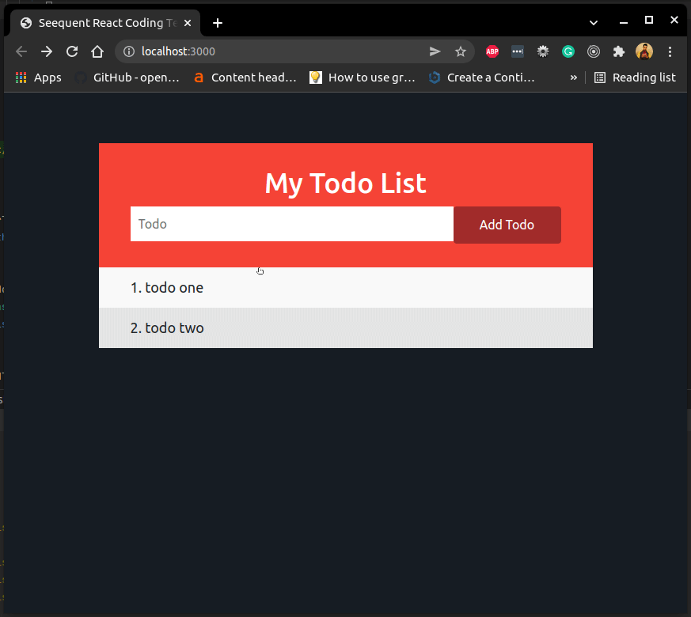

# Seequent React Coding Test

## Guidelines

Thanks for interviewing with Seequent! This front-end developer exercise involves a simple React/Redux basic Single Page
Application.

- Please review the goals and questions below.
- Create a branch to complete your tasks on.
- Commit your code to your branch
- Address the goals and questions directly in this README and commit it back to your branch
- When you are complete, please open a PR to master for review

## Timing

We ask that you aim to spend about 4 hours on this exercise. If you finish more quickly, great!

If you reach the 4 hour point, outline the tasks you have left to complete and the strategy you would use to complete
them, and then submit the exercise for review.

## Running the Application

- Install NPM: https://www.npmjs.com/get-npm
- `cd react-coding-exercise-<yourname>`
- `npm install`
- `npm start`



## Goals

- [X] Why is the app not running?
    - An initial state for the todo list was not defined.
    - `class` property was used instead of `className`
    - `LIST_TODOS` - state was being overwritten
- [X] Describe your understanding of what the current code base is doing
    - A todo app that can add and list todos. Its state is managed within a redux store.
- [X] Implement the missing Add Todo feature using the framework provided
- [X] Implement unit tests for the `TodoList` component and the `todos` state
- [X] Add some CSS to make your TODO list look a bit nicer

## Questions

- [X] Are there are bad coding practices being used, are there good coding practices that are missing?
    - Usage of deprecated lifecycle hook `componentWillMount()`. React's official documentation recommends to
      use `constructor()` instead for initial state.
    - Project Structure could have been better organized.
    - Could use typescript for better type safety.
    - Using React class for components seems to be an old way. In the newer version, they seem to be using functions.
    - `LIST_TODO` does not handle "loading" state.
    - TodoList -> `li` element did not have a unique `Key` for each item.
    - Missing standard linting (different IDEs could lead to different formatting)
    - [Optional] state(s) and action(s) can be in 2 separate files.
    - store could be moved outside `App.js` for jest.mock testing
    - Using own implementation of reducer function instead of the one from `@redux/toolkit`?
- [X] How would you better organize this code? Are there components that should be split out?
    - The todo component, css and state could be moved within a `todo` directory as shown below
      ```bash
      ├── App.css
      ├── App.js
      ├── index.css
      ├── index.js
      └── todo   
          └── state
              ├── todos.js
              └── todos.test.js
          ├── TodoList.css
          ├── TodoList.js
          └── TodoList.test.js
      ``` 
        - The todoInput (input field and the button) can be made its own component.
- [X] What is missing from this application to allow it to grow with more components and features?
    - Missing an actual serverside
    - Missing Router and Http Client setup.
    - Missing linting standards (different IDEs could lead to different formatting)
- [X] Design a REST API that this frontend would use. Include the endpoints, HTTP methods, schema for each endpoint, and
  any other information you feel is relevant. What are some of the non-functional requirements we would need to consider
  for this system? What could be used to meet those requirements?
    
    | HTTP Method | Path              | ContentType | Request Body    | Success Response                                                           |
    |-------------|-------------------|-------------|-----------------|----------------------------------------------------------------------------|
    | GET         | /todos            | json        | N/A             | `200`:  [ {id: string, todo: string }, {id: string, todo: string },  ... ] |
    | POST        | /todo,/todo/{ID} | json        | {todo: string } | `201`: { status: created } </br> `200`: { status: updated }                |
    | DELETE      | /todo/{ID}        | json        | N/A             | `200`: { status: deleted }                                                 |

  **Non-Functional Requirement:**
    - validate input - Accept only valid characters - filter out `XSS` code (follow OWASP security standards)
    - Log Request and Response for support purposes
    - Authentication and authorization
    - Set up a Rate Limit - to limit the number of API calls from the frontend
    - Implement caching for GET request(s) by using hot/cold database strategy
    - Make write requests (POST and DELETE) calls atomic or transactional
    - Response with appropriate error codes
        - `401` & `403` - Access denied
        - `400` - Bad Request
        - `500` - server error
        - `429` - Too many requests 